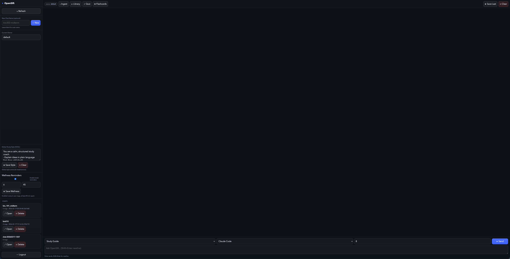

# OpenSift

[](https://github.com/OpenSift/OpenSift/actions/workflows/ci.yml)
[](https://github.com/OpenSift/OpenSift/releases)
[](https://github.com/OpenSift/OpenSift/releases)
[](LICENSE)

## Please note that this is only a hobby project, may be insecure, contain security holes, and only a proof-of-conecpt.

> Sift faster. Study smarter.

OpenSift is an AI-powered study assistant that helps students ingest large amounts of information (URLs, PDFs, lecture notes) and intelligently sift through it using semantic search and AI generation.

---

# 🎯 Why OpenSift?

Students don’t struggle because they lack information.  
They struggle because they have too much of it.

OpenSift helps by:
- Ingesting textbooks, PDFs, and web articles
- Finding only the most relevant sections
- Grounding AI responses in your materials
- Streaming answers in real-time
- Generating structured study guides and quizzes

---

# 🎬 Demo


---

# 🖼 Screenshots




---

# 🚀 Quick Start

## 1. Create a virtual environment

```
bash
python3.13 -m venv .venv
source .venv/bin/activate
```
(Recommended: Python 3.12 or 3.13)

## 2. Install dependencies

```
pip install -U pip setuptools wheel
pip install openai
pip install anthropic
pip install sentence-transformers
pip install -r requirements.txt
```

## 3. Set API Keys (Optional)

Supported providers:
	•	Claude Code (setup-token)
	•	Claude API (Anthropic)
	•	OpenAI API


Example:

export OPENAI_API_KEY="your-key"

export ANTHROPIC_API_KEY="your-key"

Claude Code users:

```
claude setup-token
export CLAUDE_CODE_OAUTH_TOKEN="..."
unset ANTHROPIC_API_KEY
```

If no provider is configured, OpenSift will still retrieve relevant passages but won’t generate AI summaries.

## 4. Run the app

### 4.a How to run it

### TEST FEATURE

From backend/:

✅ Guided setup + launch wizard (recommended)

```
python opensift.py setup
```

This workflow lets users:
- Enter/update API keys and tokens (`OPENAI_API_KEY`, `ANTHROPIC_API_KEY`, `CLAUDE_CODE_OAUTH_TOKEN`)
- Save settings to `backend/.env`
- Choose launch mode: `gateway`, `ui`, `terminal`, or `both`

✅ Gateway runner (recommended for local orchestration)

```bash
python opensift.py gateway --with-mcp
```

Gateway mode:
- Supervises OpenSift UI and optional MCP server from one command
- Runs startup health checks (`/health`)
- Handles graceful shutdown for all managed processes

✅ Web UI (localhost)

```
python opensift.py ui --reload
```

✅ Terminal chatbot

```
python opensift.py terminal --provider claude_code
```

Example: separate class namespace + quiz mode:

```
python opensift.py terminal --provider claude_code --owner bio101 --mode quiz
```
Then inside the terminal chat:
	•	Ingest a URL:
/ingest url https://en.wikipedia.org/wiki/Photosynthesis
	•	Ingest a file:
/ingest file /path/to/chapter1.pdf
	•	Ask questions normally.

### 4.b Old Method:

```
uvicorn ui_app:app --reload --host 127.0.0.1 --port 8001
```


Open:
```
http://127.0.0.1:8001/
```

The chatbot page is the default UI.

💬 Chat-First Workflow

Everything happens inside the chatbot interface.

You can:

📥 Ingest
	•	Paste a URL and ingest it
	•	Upload a PDF, TXT, or MD file
	•	Keep materials separated using the owner field

🔎 Ask Questions
	•	Ask conceptual questions
	•	Request study guides
	•	Generate quizzes
	•	Compare topics
	•	Extract key points

⚡ Streaming Responses

Responses stream live as they are generated.

You’ll see:
	•	Retrieval phase
	•	Source citations
	•	Incremental streaming output

⸻

🧠 How OpenSift Works
	1.	Text is chunked into semantic segments
	2.	Each chunk is embedded into vector space
	3.	Stored in ChromaDB
	4.	Queries retrieve relevant chunks
	5.	AI generates answers grounded in those chunks
	6.	Responses stream back to the UI

⸻

🗂 Owners (Namespaces)

Use the owner field in the chat UI to separate subjects.

Examples:
	•	bio101
	•	chem_midterm
	•	cs_final
	•	history_notes

Each owner has:
	•	Separate vector results
	•	Separate chat history

⸻

🛠 Supported Providers

Provider | Requires Key | Streaming | Notes

Claude Code | Setup token | Yes* | Recommended

Claude API | API key | Yes | Anthropic

OpenAI | API key | Yes | GPT-5.2 default

* Claude Code currently uses chunk-streaming unless native token streaming is enabled.

📂 Project Structure
```text
backend/
├── app/
│   ├── chunking.py
│   ├── ingest.py
│   ├── llm.py
│   ├── providers.py
│   ├── settings.py
│   └── vectordb.py
├── templates/
│   └── chat.html
├── static/
├── ui_app.py
└── requirements.txt
```

🔐 Environment Variables

Optional but recommended:
```
OPENAI_API_KEY=
ANTHROPIC_API_KEY=
OPENSIFT_LOG_LEVEL=INFO
OPENSIFT_LOG_DIR=.opensift_logs
OPENSIFT_LOG_MAX_BYTES=5242880
OPENSIFT_LOG_BACKUP_COUNT=5
OPENSIFT_SOUL_PATH=~/.opensift/SOUL.md
OPENSIFT_BREAK_REMINDERS_ENABLED=true
OPENSIFT_BREAK_REMINDER_EVERY_USER_MSGS=6
OPENSIFT_BREAK_REMINDER_MIN_MINUTES=45
```

🧾 Logging

OpenSift now includes centralized logging across UI, gateway, terminal chat, and MCP server.
- Default log file: `backend/.opensift_logs/opensift.log`
- Console logging + rotating file logs are enabled by default
- Configure with `OPENSIFT_LOG_*` env vars above

🎨 SOUL Personality (Study Style)

OpenSift now supports a global study style personality stored in `~/.opensift/SOUL.md` by default (override with `OPENSIFT_SOUL_PATH`) and applied everywhere (UI, terminal, all owners).
- UI: edit **Global Study Style (SOUL)** in the left sidebar, then click **Save Style**
- Terminal: use `/style`, `/style set <text>`, `/style clear`
- Styles are injected into generation prompts while still grounding answers in retrieved sources
- Legacy per-owner SOUL entries are automatically migrated into the global style block

🧘 Wellness Break Reminders

OpenSift can proactively remind learners to pause, hydrate, and rest during long study sessions.
- Reminders can include water/stretch/mental-health/sleep cues
- Triggered periodically during chat sessions (UI + terminal)
- Controlled by `OPENSIFT_BREAK_REMINDER_*` environment variables
- UI controls are available in the left sidebar (enable toggle + frequency settings)

🧭 Roadmap
	•	True token streaming from providers
	•	Chat memory persistence (SQLite)
	•	User authentication
	•	Multi-user support
	•	OCR support for scanned PDFs
	•	Docker deployment
	•	UI theming

⸻

📜 License

MIT

⸻

💡 Philosophy

OpenSift helps students focus on understanding — not searching.

It retrieves relevant material and organizes it intelligently so learners can study faster and retain more.
